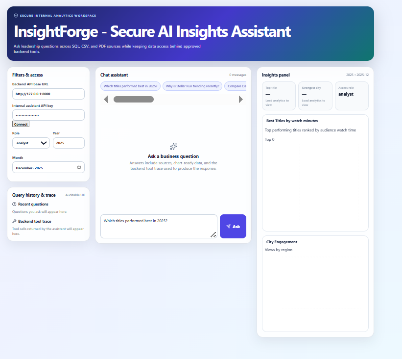
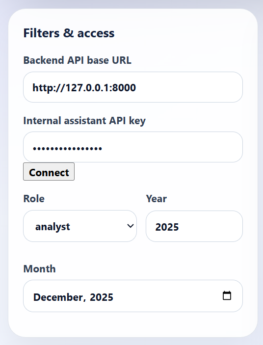
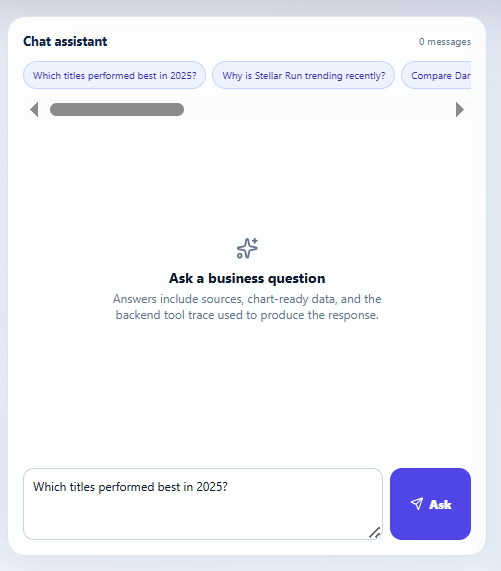
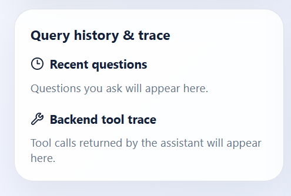
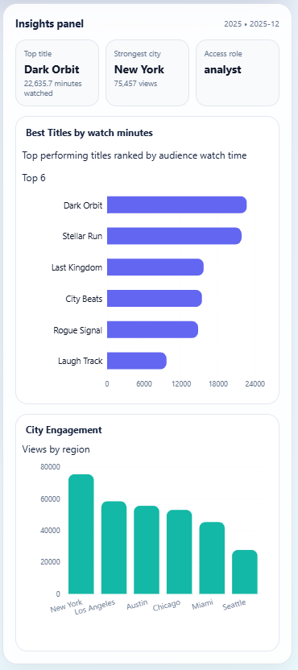

# InsightForge — Secure AI Insights Assistant

> Enterprise-grade AI analytics assistant that combines structured SQL analytics, document retrieval, secure backend tools, role-based access control, and local LLM orchestration to answer leadership business questions safely and transparently.

---

# Overview

InsightForge is a full-stack AI-powered internal analytics platform built for a fictional entertainment/media company.

The platform enables leadership and analysts to ask natural-language business questions such as:

- Which titles performed best in 2025?
- Why is *Stellar Run* trending recently?
- Compare *Dark Orbit* vs *Last Kingdom*
- Which city had the strongest engagement last month?
- What explains weak comedy performance?

Instead of giving the LLM unrestricted database access, InsightForge follows a secure enterprise architecture:

- backend-approved analytics tools
- controlled SQL access
- document retrieval layer
- role-based authorization
- audit-friendly tool traces
- PII protection
- explainable responses

The system combines:

- Structured SQL analytics
- CSV business datasets
- Internal PDF reports
- Retrieval-Augmented Generation (RAG)
- Local LLM inference using Ollama
- Interactive React dashboards
- Dockerized deployment

---

# Screenshots

## Dashboard Overview



---

## Filter and Access



---

## AI Analytics Assistant



---

## Backend Tool Trace



---

## Analytics Visualizations



# Key Features

## AI Analytics Assistant
- Ask business questions in natural language
- AI-generated executive-style insights
- Quantitative analytics synthesis
- Evidence-backed responses

---

## Structured Analytics Engine
Backend analytics tools include:

- Best performing titles
- Title comparison
- City engagement analysis
- Genre growth analysis
- Weak comedy performance analysis
- Safe read-only SQL querying

---

## Retrieval-Augmented Generation (RAG)
- Internal PDF report ingestion
- Lightweight document retrieval
- Supporting report citations
- Context-aware AI responses

---

## Enterprise Security
- API key authentication
- Role-based access control (RBAC)
- Read-only SQL validation
- PII masking
- Approved backend tool access only
- Auditable tool traces

---

## Interactive Frontend Dashboard
- React + Vite UI
- Analytics visualizations
- Query history
- Tool trace inspection
- Authentication workflow
- Role-based interaction

---

## Dockerized Full-Stack Setup
- Backend Docker container
- Frontend Docker container
- Docker Compose orchestration
- Portable local deployment

---

# Tech Stack

## Frontend
- React
- TypeScript
- Vite
- Recharts
- Lucide Icons
- Custom CSS

---

## Backend
- FastAPI
- Python 3.12
- SQLite
- Pydantic
- Uvicorn

---

## AI / LLM
- Ollama
- Llama 3.1 8B
- OpenAI-compatible API layer

---

## Data Processing
- CSV ingestion
- PDF parsing
- Lightweight retrieval engine
- SQL analytics layer

---

## DevOps
- Docker
- Docker Compose
- Logging infrastructure

---

# System Architecture

```text
┌────────────────────────────────────────────────────────────┐
│                        Frontend UI                         │
│                  React + Vite Dashboard                    │
└────────────────────────────────────────────────────────────┘
                           │
                           ▼
┌────────────────────────────────────────────────────────────┐
│                      FastAPI Backend                       │
│                                                            │
│  - Authentication                                          │
│  - RBAC Authorization                                      │
│  - Analytics APIs                                          │
│  - Orchestration Layer                                     │
│  - Tool Trace Logging                                      │
└────────────────────────────────────────────────────────────┘
                           │
        ┌──────────────────┼──────────────────┐
        ▼                  ▼                  ▼

┌──────────────┐  ┌────────────────┐  ┌────────────────┐
│ SQL Tools    │  │ Document       │  │ Ollama LLM     │
│ Analytics    │  │ Retrieval      │  │ Llama3.1:8b    │
└──────────────┘  └────────────────┘  └────────────────┘
        │                  │
        ▼                  ▼

┌──────────────┐  ┌────────────────┐
│ SQLite DB    │  │ Internal PDFs  │
│ CSV Data     │  │ Reports         │
└──────────────┘  └────────────────┘
```

---

# User Flow

```text
User asks business question
            │
            ▼
Frontend sends authenticated API request
            │
            ▼
FastAPI validates API key + role
            │
            ▼
Orchestrator selects approved backend tools
            │
            ▼
Analytics tools query SQLite safely
            │
            ▼
Retriever fetches relevant PDF snippets
            │
            ▼
Structured context passed to Ollama LLM
            │
            ▼
LLM generates executive insight response
            │
            ▼
Frontend displays:
- AI answer
- charts
- tool trace
- source documents
- audit metadata
```

---

# Repository Structure

```text
InsightForge/
│
├── backend/
│   ├── services/
│   │   ├── llm.py
│   │   ├── orchestrator.py
│   │   ├── retriever.py
│   │   ├── security.py
│   │   ├── tools.py
│   │   ├── ingest.py
│   │   ├── config.py
│   │   └── logger.py
│   │
│   ├── data/
│   │   ├── csv/
│   │   ├── pdf/
│   │   └── assistant.db
│   │
│   ├── app.py
│   └── __init__.py
│
├── frontend/
│   ├── src/
│   ├── public/
│   ├── package.json
│   ├── vite.config.js
│   └── Dockerfile
│
├── scripts/
│   └── generate_demo_data.py
│
├── docker-compose.yml
├── Dockerfile
├── pyproject.toml
├── uv.lock
└── README.md
```

---

# Setup Instructions

# Prerequisites

Install:

- Python 3.12+
- Node.js 20+
- Docker Desktop
- Ollama

---

# Install Ollama

Download:

https://ollama.com

Pull model:

```bash
ollama pull llama3.1:8b
```

Start Ollama:

```bash
ollama serve
```

---

# Environment Variables

Create `.env`

```env
ASSISTANT_API_KEY=dev-internal-key
OLLAMA_API_KEY=ollama
```

---

# Option 1 — Local Development Setup

# Backend Setup

## Create Virtual Environment

```bash
uv venv
```

Activate:

### Windows

```bash
.venv\Scripts\activate
```

### Linux / macOS

```bash
source .venv/bin/activate
```

---

## Install Dependencies

```bash
uv sync
```

---

## Generate Demo Data

```bash
uv run python scripts/generate_demo_data.py
```

---

## Start Backend

```bash
uv run uvicorn backend.app:app --reload --port 8000
```

Backend runs on:

```text
http://localhost:8000
```

Swagger Docs:

```text
http://localhost:8000/docs
```

---

# Frontend Setup

Move to frontend:

```bash
cd frontend
```

Install dependencies:

```bash
npm install
```

Run frontend:

```bash
npm run dev
```

Frontend:

```text
http://localhost:5173
```

---

# Option 2 — Docker Setup

# Backend Docker

Build image:

```bash
docker build -t insightforge-backend .
```

Run container:

```bash
docker run --env-file .env -p 8000:8000 insightforge-backend
```

---

# Frontend Docker

Move to frontend:

```bash
cd frontend
```

Build image:

```bash
docker build -t insightforge-frontend .
```

Run:

```bash
docker run -p 5173:5173 insightforge-frontend
```

---

# Option 3 — Docker Compose (Recommended)

From project root:

```bash
docker compose up --build
```

This starts:
- frontend
- backend
- networking
- environment setup

automatically.

---

# API Examples

# Chat Endpoint

```bash
curl -H "X-API-Key: dev-internal-key" \
     -H "X-User-Role: analyst" \
     -H "Content-Type: application/json" \
     -d "{\"question\":\"Which titles performed best in 2025?\"}" \
     http://localhost:8000/api/chat
```

---

# Analytics Endpoint

```bash
curl -H "X-API-Key: dev-internal-key" \
     -H "X-User-Role: analyst" \
     http://localhost:8000/api/analytics/best-titles?year=2025
```

---

# Supported User Roles

| Role | Access |
|---|---|
| analyst | analytics + reports |
| marketing | analytics + marketing insights |
| leadership | full analytics + ingestion |

---

# Logging Infrastructure

InsightForge includes centralized logging:

- API requests
- authentication attempts
- SQL queries
- orchestration flow
- LLM execution
- tool usage
- errors/exceptions

Logs are written to:

```text
logs/insightforge.log
```

---

# Security Features

## Authentication
- API-key based access control

## RBAC
- Role-scoped permissions

## Safe SQL
- Read-only SELECT-only validation

## PII Protection
- Email masking
- Restricted data exposure

## Tool Isolation
- LLM cannot access raw DB directly

## Explainability
- Tool traces
- source references
- document provenance

---

# Assumptions & Tradeoffs

## Assumptions

- The platform is designed as an internal enterprise analytics assistant for authenticated users only.
- SQLite was assumed sufficient for the prototype scale and local execution requirements.
- Ollama with Llama 3.1 8B was chosen to enable fully local LLM inference without external API dependency.
- Business datasets and internal reports are assumed to be trusted and pre-ingested by administrators.
- API-key based authentication was assumed acceptable for prototype-level internal access control.
- Users are assumed to interact through approved backend analytics tools rather than direct database access.

---

## Tradeoffs

### SQLite vs PostgreSQL
SQLite was chosen for simplicity, portability, and fast local setup.  
Tradeoff: Lacks horizontal scalability and advanced concurrency features required for production workloads.

---

### Lightweight Retrieval vs Vector Database
A lightweight retrieval approach was implemented instead of a full embedding/vector database pipeline.  
Tradeoff: Simpler architecture and faster implementation, but lower semantic retrieval quality compared to production RAG systems.

---

### Local Ollama Inference vs Hosted LLM APIs
Local Ollama inference improves privacy, portability, and removes external API cost dependencies.  
Tradeoff: Slower inference speed and reduced model capability compared to enterprise hosted models.

---

### API Key Authentication vs OAuth/JWT
Simple API-key authentication was implemented for faster prototype development.  
Tradeoff: Lacks enterprise-grade identity management, token expiration, SSO integration, and fine-grained user management.

---

### Backend-Controlled Tools vs Autonomous Agent Access
The LLM is intentionally restricted to approved backend analytics tools rather than unrestricted SQL/database access.  
Tradeoff: Reduced flexibility, but significantly improved security, explainability, auditability, and reliability.

---

### Focus on Reliability Over Agent Complexity
The orchestration layer prioritizes deterministic backend analytics and structured prompts over fully autonomous agent workflows.  
Tradeoff: Less flexible agent behavior, but more reliable and explainable outputs.

# Example Questions

```text
Which titles performed best in 2025?
```

```text
Why is Stellar Run trending recently?
```

```text
Compare Dark Orbit vs Last Kingdom.
```

```text
Which city had the strongest engagement last month?
```

```text
What explains weak comedy performance?
```

```text
What recommendations would you give for leadership?
```

---

# Author

Rishav Raj Bhagat
---


